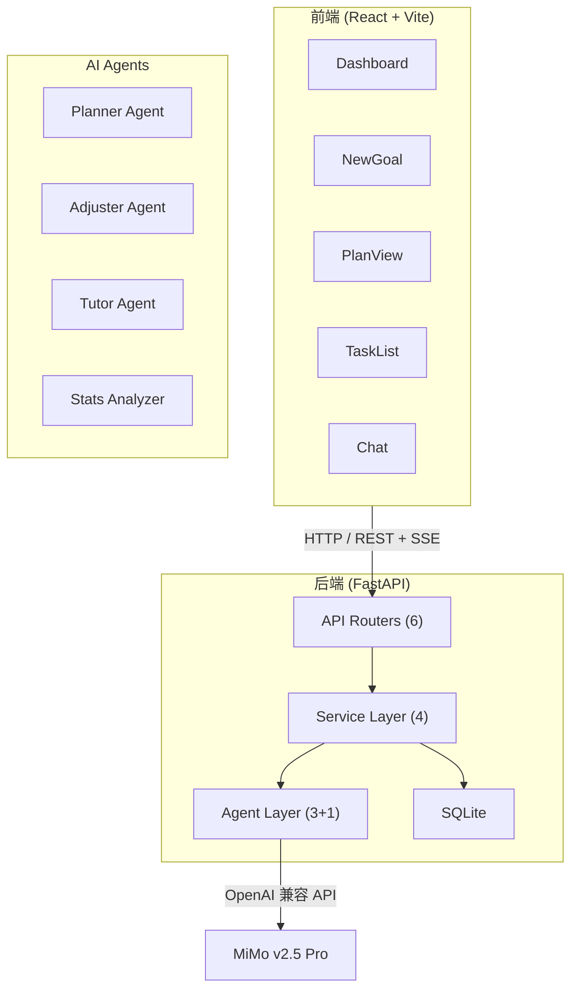

<p align="center">
  <h1 align="center">LearnPilot</h1>
  <p align="center">AI Agent 驱动的个人学习规划系统</p>
  <p align="center">
    
    
    
    
    
  </p>
</p>

---

不是聊天机器人，而是**会规划、会调整、会辅导**的多 Agent 协作学习系统。

用户输入学习目标后，Planner Agent 自动生成分阶段计划，Adjuster Agent 根据进度动态调整，Tutor Agent 基于当前任务上下文提供针对性辅导。三个 Agent 各司其职，通过结构化数据通信，而非一个大 prompt 打天下。

## 核心痛点

| 痛点 | LearnPilot 的解法 |
|------|------------------|
| 想学新东西但不知道从哪开始 | Planner Agent 自动生成分阶段学习计划 |
| 计划赶不上变化，经常半途而废 | Adjuster Agent 根据进度和反馈动态调整 |
| 学习中遇到问题没人问 | Tutor Agent 基于当前任务上下文答疑 |
| 手动管理学习任务太麻烦 | 自动任务拆解 + 进度追踪 + 统计仪表盘 |

## 为什么不是普通 AI 聊天

| 维度 | 普通 AI 聊天 | LearnPilot |
|------|-------------|-----------|
| 架构 | 单个大 prompt | 3 个专用 Agent 协作 |
| 输出 | 自由文本 | 结构化 JSON（phases / tasks / adjustments） |
| 状态 | 无状态 | SQLite 持久化（目标、任务、进度、对话历史） |
| 规划 | 一次性回答 | 生成 → 执行 → 反馈 → 动态调整闭环 |
| 上下文 | 通用聊天 | 感知 goal、task、skill_level、完成率 |

## AI Agent 架构

```
┌─────────────────────────────────────────────────────────┐
│                        用户                              │
│    创建目标 / 查看计划 / 标记完成 / 提问 / 请求调整        │
└──────────────┬──────────────────────────┬───────────────┘
               │                          │
       ┌───────▼───────┐          ┌───────▼───────┐
       │  Planner Agent │          │  Tutor Agent  │
       │  生成学习计划   │          │  学习辅导答疑  │
       └───────┬───────┘          └───────────────┘
               │
       ┌───────▼───────┐
       │ Adjuster Agent │
       │  动态调整计划   │
       └───────────────┘
```

| Agent | 职责 | 输入 | 输出 |
|-------|------|------|------|
| **Planner** | 生成分阶段学习计划 | 目标描述、每日时长、周期、技能水平 | phases → tasks（含日期、类型、排序） |
| **Adjuster** | 根据进度动态调整计划 | 目标信息、任务统计、未完成列表、用户反馈 | 进度分析 + 调整方案（reschedule / update / keep） |
| **Tutor** | 基于上下文学习辅导 | 目标信息、当前任务、对话历史、用户问题 | 结构化回答（结论、解释、代码示例、资源推荐） |

所有 Agent 继承 `BaseAgent`，内置指数退避重试（最多 3 次）、JSON 容错解析、结构化日志。

## 核心功能

- **用户认证** — 注册 / 登录，JWT Token，数据隔离
- **智能规划** — 创建目标后 AI 自动生成分阶段学习计划
- **动态调整** — 根据进度和反馈，AI 重新规划未完成任务
- **学习辅导** — SSE 流式对话，基于任务上下文的针对性答疑
- **进度追踪** — 任务状态管理（待办 / 进行中 / 已完成），统计仪表盘
- **数据导出** — Markdown 学习报告 + JSON 全量备份
- **后端健壮** — API 调用重试、AI 接口限流（20 次/分钟）、结构化日志
- **容器化部署** — Docker Compose 一键启动

## 技术栈

| 层 | 技术 |
|----|------|
| 前端 | React 18 + TypeScript + Vite + Tailwind CSS + React Router 6 |
| 后端 | FastAPI + Python 3.12 + SQLite |
| AI | MiMo v2.5 Pro（OpenAI 兼容协议） |
| 认证 | JWT（python-jose）+ bcrypt |
| 部署 | Docker + Nginx 反向代理 |

## 系统架构



## 快速开始

### 方式一：本地开发

```bash
git clone https://github.com/Slove-hib/LearnPilot.git
cd LearnPilot
```

**后端：**

```bash
cd backend

python -m venv venv
source venv/Scripts/activate      # Windows Git Bash
# 或 venv\Scripts\activate        # Windows CMD

pip install -r requirements.txt

cp .env.example .env
# 编辑 .env，填入你的 MIMO_API_KEY

uvicorn main:app --reload
```

访问 http://localhost:8000/docs 查看 Swagger 文档。

**前端：**

```bash
cd frontend

npm install
npm run dev
```

访问 http://localhost:5173

### 方式二：Docker 部署

```bash
# 先配置 backend/.env
cp backend/.env.example backend/.env
# 编辑 .env 填入 API Key

docker compose up -d --build
```

访问 http://localhost

### 环境变量

```env
# backend/.env
MIMO_API_KEY=your-api-key-here
MIMO_MODEL=mimo-v2.5-pro
MIMO_BASE_URL=https://token-plan-cn.xiaomimimo.com/v1
DATABASE_PATH=learnpilot.db
JWT_SECRET_KEY=change-this-to-a-random-secret
JWT_ALGORITHM=HS256
JWT_EXPIRE_MINUTES=1440
CORS_ORIGINS=http://localhost:5173,http://localhost:3000
```

## API 接口

| 方法 | 路径 | 说明 | 认证 |
|------|------|------|------|
| POST | `/api/auth/register` | 用户注册 | - |
| POST | `/api/auth/login` | 用户登录 | - |
| POST | `/api/goals` | 创建目标（触发 Planner） | JWT |
| GET | `/api/goals` | 获取所有目标 | JWT |
| GET | `/api/goals/{id}/plan` | 获取完整计划 | JWT |
| POST | `/api/goals/{id}/plan/adjust` | 调整计划（触发 Adjuster） | JWT |
| GET | `/api/tasks/today` | 获取今日任务 | JWT |
| GET | `/api/tasks?goal_id=&date=` | 按条件查询任务 | JWT |
| PATCH | `/api/tasks/{id}` | 修改任务状态 | JWT |
| GET | `/api/stats/overview` | 学习进度统计 | JWT |
| GET | `/api/stats/analysis` | AI 进度分析 | JWT |
| POST | `/api/chat` | 同步对话（触发 Tutor） | JWT |
| POST | `/api/chat/stream` | SSE 流式对话 | JWT |
| GET | `/api/chat/history?goal_id=` | 查询对话历史 | JWT |
| GET | `/api/export/report` | 导出 Markdown 报告 | JWT |
| GET | `/api/export/data` | 导出 JSON 备份 | JWT |

## 页面说明

| 页面 | 路径 | 功能 |
|------|------|------|
| 登录 / 注册 | `/login` `/register` | 用户认证 |
| Dashboard | `/` | 统计卡片、进度条、AI 分析、今日任务、数据导出 |
| New Goal | `/goals/new` | 创建学习目标（触发 Planner Agent） |
| Plans | `/plan` | 目标列表 |
| Plan View | `/plan/:goalId` | 计划展示、任务状态切换、AI 调整计划 |
| Tasks | `/tasks` | 任务列表、按目标/日期筛选、状态修改 |
| Chat | `/chat` | SSE 流式对话、Markdown 渲染、代码高亮 |

## 项目结构

```
LearnPilot/
├── docker-compose.yml
├── backend/
│   ├── Dockerfile
│   ├── main.py                    # FastAPI 入口
│   ├── config.py                  # 环境变量配置
│   ├── database.py                # SQLite 连接 + 建表
│   ├── auth.py                    # JWT 认证
│   ├── rate_limit.py              # 接口限流
│   ├── models/schemas.py          # Pydantic 数据模型
│   ├── agents/
│   │   ├── base.py                # Agent 基类（重试、JSON 解析）
│   │   ├── planner.py             # Planner Agent
│   │   ├── adjuster.py            # Adjuster Agent
│   │   └── tutor.py               # Tutor Agent（支持流式）
│   ├── services/                  # 业务逻辑层
│   ├── routers/                   # API 路由层
│   └── tests/                     # pytest 测试（25 个）
│
└── frontend/
    ├── Dockerfile
    ├── nginx.conf                  # Nginx 反向代理
    └── src/
        ├── api/                    # API 调用层
        ├── components/             # Layout、Sidebar、Header 等
        └── pages/                  # 8 个页面
```

## 测试

```bash
cd backend
source venv/Scripts/activate
python -m pytest tests/ -v
```

25 个测试覆盖：认证流程、API 端点、用户隔离、限流逻辑。

## 后续可扩展方向

- 知识图谱可视化（学习路径拓扑图）
- 微信 / 邮件提醒（每日任务推送）
- 学习资源推荐（自动爬取教程链接）
- 多人协作（学习小组、排行榜）
- 移动端适配（响应式 / PWA）
- Agent 执行日志可视化（展示 Agent 思考过程）

## 简历描述

**简洁版：**

> 基于 MiMo API 的多 Agent 学习规划系统。Planner / Adjuster / Tutor 三个 Agent 协作，实现自动规划、动态调整、上下文辅导。React + FastAPI 全栈，JWT 认证、SSE 流式、Docker 部署。

**详细版：**

> 设计并实现了一个 AI Agent 驱动的全栈学习规划系统。核心亮点是多 Agent 协作架构：Planner Agent 解析学习目标并生成分阶段计划；Adjuster Agent 根据用户反馈和实际进度动态调整任务；Tutor Agent 基于当前学习上下文提供针对性辅导并推荐资源。三个 Agent 通过结构化 JSON 通信，后端统一校验和持久化。前端 React + TypeScript + Tailwind（8 个页面），后端 FastAPI + SQLite（16 个 API），支持 JWT 认证、SSE 流式对话、数据导出、接口限流、Docker 部署，25 个自动化测试。

---

**License:** MIT
