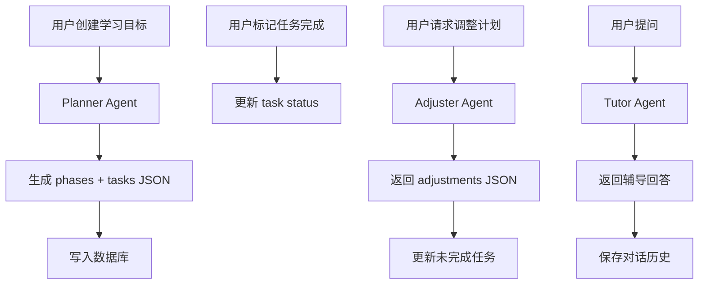

# LearnPilot 架构设计文档

## 1. 系统整体架构

LearnPilot 采用前后端分离架构，后端负责 AI Agent 调度和数据持久化，前端负责交互和展示。

```
┌─────────────────────────────────────────────────┐
│                   前端 (React)                   │
│  Dashboard / NewGoal / PlanView / TaskList / Chat│
└───────────────────────┬─────────────────────────┘
                        │ HTTP REST
┌───────────────────────▼─────────────────────────┐
│                  后端 (FastAPI)                   │
│  ┌─────────┐  ┌──────────┐  ┌─────────────────┐ │
│  │ Routers  │→ │ Services │→ │ Agents (MiMo)   │ │
│  └─────────┘  └────┬─────┘  └─────────────────┘ │
│                    │                              │
│              ┌─────▼─────┐                        │
│              │  SQLite    │                        │
│              └───────────┘                        │
└─────────────────────────────────────────────────┘
```

## 2. 前端模块划分

```
src/
├── api/            # API 调用封装（axios）
│   ├── client.ts   # axios 实例，JWT 拦截器 + 401 重定向
│   ├── goals.ts    # 目标相关 API
│   ├── tasks.ts    # 任务相关 API
│   ├── stats.ts    # 统计相关 API
│   ├── chat.ts     # 对话 API（含 SSE 流式）
│   └── export.ts   # 数据导出 API
├── components/     # 通用组件
│   ├── Layout.tsx  # 页面布局（Sidebar + Header + Outlet）
│   ├── Sidebar.tsx # 侧边导航
│   ├── Header.tsx  # 顶部栏 + 登出
│   ├── StatCard.tsx# 统计卡片
│   ├── EmptyState.tsx # 空状态
│   └── RequireAuth.tsx # 路由守卫
└── pages/          # 页面组件
    ├── Login.tsx       # 登录
    ├── Register.tsx    # 注册
    ├── Dashboard.tsx   # 仪表盘 + 导出
    ├── GoalList.tsx    # 目标列表
    ├── NewGoal.tsx     # 创建目标
    ├── PlanView.tsx    # 计划展示 + 调整
    ├── TaskList.tsx    # 任务列表
    └── Chat.tsx        # AI 对话（SSE 流式）
```

**数据流：**
- 页面组件通过 `api/*.ts` 调用后端
- 使用 `useState` 管理页面状态
- 使用 `useEffect` 在页面加载时请求数据
- 不使用全局状态管理（Redux 等）

## 3. 后端模块划分

```
backend/
├── main.py         # FastAPI 入口，注册路由，启动时建表
├── config.py       # 读取 .env 配置
├── database.py     # SQLite 连接管理 + 建表 SQL
├── auth.py         # JWT 认证（密码哈希、Token 生成、用户验证）
├── rate_limit.py   # 接口限流（通用 60/min，AI 接口 20/min）
├── models/
│   └── schemas.py  # Pydantic 数据模型（请求/响应/Agent 输出）
├── agents/         # AI Agent 层
│   ├── base.py     # Agent 基类（OpenAI 兼容 API、重试、JSON 解析）
│   ├── planner.py  # Planner Agent
│   ├── adjuster.py # Adjuster Agent
│   └── tutor.py    # Tutor Agent（支持流式输出）
├── services/       # 业务逻辑层
│   ├── plan_service.py       # 创建目标 + 调用 Planner
│   ├── task_service.py       # 任务查询/更新/统计
│   ├── adjustment_service.py # 调用 Adjuster + 应用调整
│   └── chat_service.py       # 调用 Tutor + 消息持久化 + 流式
├── routers/        # API 路由层
│   ├── auth.py     # /api/auth（注册/登录）
│   ├── goals.py    # /api/goals
│   ├── tasks.py    # /api/tasks
│   ├── stats.py    # /api/stats
│   ├── chat.py     # /api/chat（含 SSE 流式）
│   └── export.py   # /api/export（Markdown 报告 + JSON 备份）
└── tests/          # pytest 测试（25 个）
    ├── test_api.py
    ├── test_auth.py
    └── test_rate_limit.py
```

**分层职责：**
- **Routers**：接收请求、参数校验、错误处理、返回响应
- **Services**：业务编排、数据库操作、调用 Agent
- **Agents**：封装 OpenAI 兼容 API 调用、构造 prompt、解析输出、重试逻辑

## 4. 数据库表设计

### goals 表

| 字段 | 类型 | 说明 |
|------|------|------|
| id | INTEGER PK | 主键 |
| user_id | INTEGER FK | 关联用户 |
| title | TEXT | 学习目标标题 |
| description | TEXT | 详细描述 |
| daily_hours | REAL | 每日可用学习时间 |
| duration_weeks | INTEGER | 计划周期（周） |
| skill_level | TEXT | beginner / intermediate / advanced |
| status | TEXT | active / completed / paused |
| created_at | DATETIME | 创建时间 |

### phases 表

| 字段 | 类型 | 说明 |
|------|------|------|
| id | INTEGER PK | 主键 |
| goal_id | INTEGER FK | 关联目标 |
| title | TEXT | 阶段标题 |
| description | TEXT | 阶段说明 |
| sort_order | INTEGER | 排序 |
| week_start | INTEGER | 开始周 |
| week_end | INTEGER | 结束周 |

### tasks 表

| 字段 | 类型 | 说明 |
|------|------|------|
| id | INTEGER PK | 主键 |
| phase_id | INTEGER FK | 关联阶段 |
| goal_id | INTEGER FK | 关联目标 |
| title | TEXT | 任务标题 |
| description | TEXT | 任务说明 |
| task_date | DATE | 计划执行日期 |
| task_type | TEXT | learn / practice / review / project |
| status | TEXT | pending / in_progress / done |
| completed_at | DATETIME | 完成时间 |
| sort_order | INTEGER | 排序 |

### messages 表

| 字段 | 类型 | 说明 |
|------|------|------|
| id | INTEGER PK | 主键 |
| goal_id | INTEGER FK | 关联目标 |
| task_id | INTEGER FK | 关联任务（可选） |
| role | TEXT | user / assistant |
| content | TEXT | 消息内容 |
| agent_type | TEXT | tutor |
| created_at | DATETIME | 创建时间 |

### users 表

| 字段 | 类型 | 说明 |
|------|------|------|
| id | INTEGER PK | 主键 |
| username | TEXT UNIQUE | 用户名 |
| hashed_password | TEXT | bcrypt 哈希密码 |
| created_at | DATETIME | 注册时间 |

**关系：** users 1→N goals 1→N phases 1→N tasks，goals 1→N messages

## 5. Agent 调度流程



## 6. Planner Agent 工作流

```
输入：
  - title: "Learn Python Backend"
  - description: "Zero to backend developer"
  - daily_hours: 2
  - duration_weeks: 8
  - skill_level: "beginner"
  - start_date: "2026-05-10"

处理：
  1. 分析目标领域所需知识体系
  2. 按 skill_level 确定起点
  3. 按 duration_weeks 划分 3-5 个阶段
  4. 每阶段拆解为周任务
  5. 每周任务拆解为每日任务（不超过 daily_hours）
  6. 安排 learn → practice → project 的节奏

输出：
  {
    "phases": [
      {
        "title": "Python Basics",
        "week_start": 1, "week_end": 3,
        "tasks": [
          { "title": "...", "task_date": "2026-05-10", "task_type": "learn" }
        ]
      }
    ]
  }
```

## 7. Adjuster Agent 工作流

```
输入：
  - goal 信息
  - 任务统计（total, completed, overdue）
  - 未完成任务列表
  - 用户反馈

处理：
  1. 评估当前进度 vs 计划进度的偏差
  2. 识别用户实际学习节奏
  3. 重新排列未完成任务
  4. 保持学习路径逻辑顺序

输出：
  {
    "analysis": "当前完成率35%，进度略落后...",
    "adjustments": [
      { "task_id": 12, "action": "reschedule", "new_date": "2026-05-15", "reason": "..." }
    ]
  }
```

## 8. Tutor Agent 工作流

```
输入：
  - goal 信息（title, skill_level）
  - 当前 task 信息（title, description, status）
  - 最近对话历史
  - 用户问题

处理：
  1. 根据 skill_level 调整解释深度
  2. 结合当前学习任务上下文
  3. 使用类比、代码示例、分步解释
  4. 引导理解，不直接代写作业

输出：
  自然语言回答
```

## 9. 为什么使用多 Agent

| 维度 | 单 Agent | 多 Agent |
|------|---------|---------|
| Prompt 复杂度 | 一个大 prompt 包含所有指令 | 每个 Agent prompt 专注单一职责 |
| 输出质量 | 容易混淆任务类型 | 每个 Agent 输出更精准 |
| 可调试性 | 难以定位问题 | 每个 Agent 独立日志 |
| 可扩展性 | 加新功能要改大 prompt | 新增 Agent 即可 |
| 简历展示 | "用了 LLM API" | "多 Agent 协作架构" |

## 10. 当前系统的局限性

| 局限 | 说明 |
|------|------|
| 单机部署 | SQLite 单文件，不适合高并发 |
| 无提醒机制 | 没有邮件/微信推送 |
| Agent 无记忆 | 每次调用都是独立的，不学习用户习惯 |
| 无前端测试 | 测试仅覆盖后端 |

## 11. 后续优化方向

1. **知识图谱**：可视化学习路径拓扑
2. **Agent 记忆**：记录用户学习偏好
3. **资源推荐**：自动推荐教程和文档
4. **移动端**：响应式布局或 PWA
5. **部署优化**：PostgreSQL 替代 SQLite
6. **前端测试**：Vitest + Testing Library
